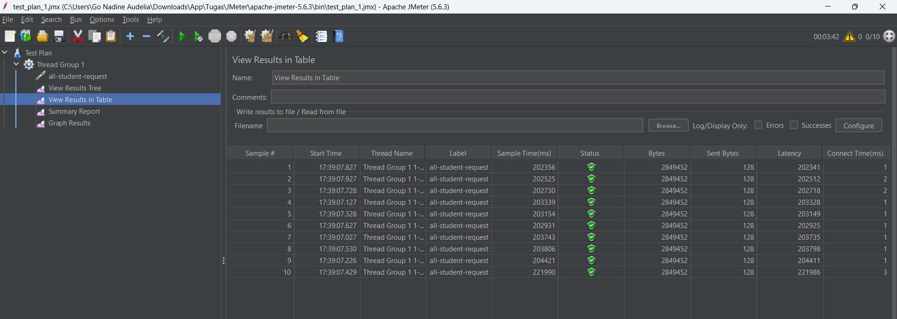
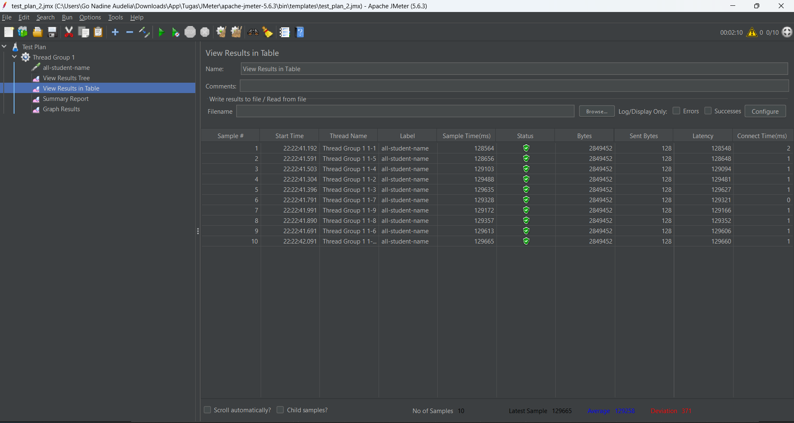
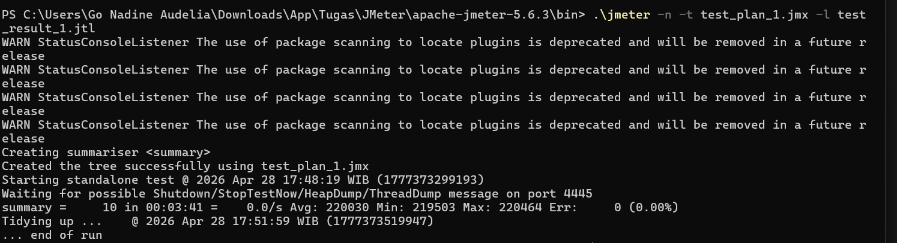
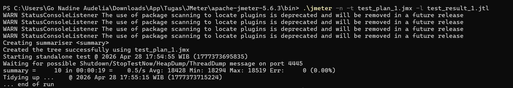
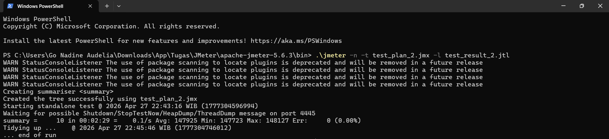
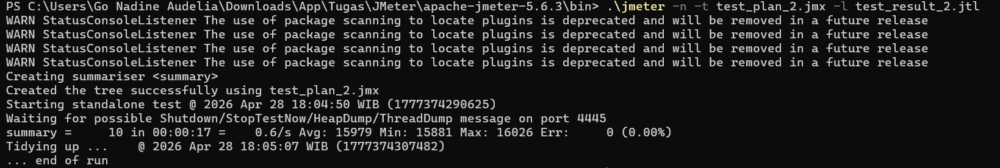
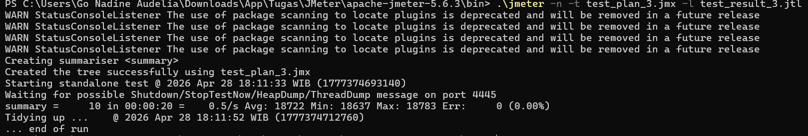

Nama = Go Nadine Audelia

## Performance testing ##

JMeter GUI all-student

JMeter GUI all-student-name

JMeter GUI untuk test plan highest-gpa

## Profiling ##

Before Optimization all-student

After Optimization all-student

Penjelasan: Sebelum optimasi, endpoint ini memerlukan waktu rata-rata 220.030 ms atau 3 menit 40 detik karena ada masalah N+1 Query. Setelah dioptimasi dengan memanggil studentCourseRepository.findAll() secara langsung, waktu respons turun menjadi 18.428 ms dengan peningkatan performa sebesar 91,6%. Dengan mengambil seluruh data relasi StudentCourse sekaligus dalam satu kueri, aplikasi berhasil menghilangkan beban ribuan koneksi berulang ke database sehingga proses pengolahan ribuan data menjadi jauh lebih efisien.

Before Optimization all-student-name

After Optimization all-student-name

Penjelasan: Sebelum optimasi, endpoint ini perlu waktu 147925 ms atau 2 menit 29 detik. Masalah utama terletak pada proses manipulasi String sebanyak 20.000 data yang tidak efisien sehingga membebani memori dan CPU secara berlebihan. Setelah kode diperbaiki menggunakan metode String.join, waktu respons rata-rata turun menjadi 15.979 ms. Optimasi ini memberikan peningkatan performa sebesar 89,2%, membuktikan bahwa penggunaan fungsi bawaan Java yang efisien untuk menangani data besar sangat krusial dalam menjaga stabilitas aplikasi.

Before Optimization highest-gpa

After Optimization highest-gpa

Penjelasan: Sebelum dilakukan optimasi, endpoint ini memiliki waktu respons rata-rata yang sangat lambat yaitu 140.790 ms atau 2 menit 22 detik. Hal ini terjadi karena aplikasi menarik 20.000 data mahasiswa dari database ke memori aplikasi lalu melakukan pencarian IPK tertinggi menggunakan perulangan secara manual. Setelah dioptimasi dengan menerapkan proses pencarian dan pengurutan langsung ke level database melalui findFirstByOrderByGpaDesc(), waktu respons rata-rata turun menjadi 18.722 ms. Perubahan ini memberikan peningkatan performa sebesar 86,7% yang membuktikan bahwa pemrosesan data di sisi database jauh lebih efisien dibandingkan menarik data besar ke sisi aplikasi.

## REFLECTION ##

1. What is the difference between the approach of performance testing with JMeter and profiling with IntelliJ Profiler in the context of optimizing application performance?

JMeter berfungsi sebagai alat performance testing dari sisi eksternal yang mengukur metrik seperti response time, throughput, dan latency saat aplikasi diberi beban. Sedangkan, IntelliJ Profiler adalah alat profiling internal yang menganalisis penggunaan sumber daya di dalam kode seperti CPU Time dan alokasi memori. JMeter memberitahu bahwa aplikasi lambat dan Profiler menunjukkan dimana letak kelambatannya di dalam baris kode.

2. How does the profiling process help you in identifying and understanding the weak points in your application?

Proses profiling membantu mengidentifikasi titik lemah dengan memberikan visualisasi jalur eksekusi aplikasi. Melalui fitur seperti Flame Graph, saya bisa melihat metode mana yang menjadi memakan waktu CPU paling lama. Misalnya, saya bisa menyadari bahwa sebuah loop sederhana menjadi sangat berat karena melakukan query database berulang kali disebabkan oleh masalah N+1.

3. Do you think IntelliJ Profiler is effective in assisting you to analyze and identify bottlenecks in your application code?

Menurut saya, IntelliJ Profiler sangat efektif karena memungkinkan untuk langsung melompat ke baris kode yang bermasalah. Fitur Comparison View juga sangat membantu untuk memvalidasi secara objektif apakah perubahan kode yang saya lakukan benar-benar mengurangi beban CPU.

4. What are the main challenges you face when conducting performance testing and profiling, and how do you overcome these challenges?

Tantangan terbesar adalah menjaga konsistensi lingkungan pengujian. Terkadang hasil tes bisa menipu karena adanya caching pada database yang membuat aplikasi terasa lebih cepat dari aslinya. Saya mengatasinya dengan melakukan hard reset yaitu mematikan aplikasi dan Docker serta melakukan beberapa kali warmup run sebelum mengambil data final.

5. What are the main benefits you gain from using IntelliJ Profiler for profiling your application code?

Manfaat utamanya adalah presisi karena tanpa menggunakan profiler maka optimasi hanya didasarkan pada tebakan. Dengan Profiler, saya mendapatkan data konkret tentang penggunaan CPU. Hal ini memungkinkan saya melakukan optimasi yang tepat sasaran sehingga saya tidak membuang waktu memperbaiki bagian kode yang sebenarnya sudah cukup cepat.

6. How do you handle situations where the results from profiling with IntelliJ Profiler are not entirely consistent with findings from performance testing using JMeter?

Jika ada ketidakkonsistenan pada hasil profiling dari JMeter dan Intelij Profiler maka itu adalah indikasi bahwa terdapat masalah di I/O atau Network. Dalam situasi ini, saya akan memeriksa latensi jaringan, performa query database, atau antrean pada connection pool. Saya menangani ketidakkonsistenan ini dengan memisahkan waktu I/O dan waktu CPU.

7. What strategies do you implement in optimizing application code after analyzing results from performance testing and profiling? How do you ensure the changes you make do not affect the application's functionality?

Strategi utama saya adalah mengganti algoritma yang memiliki kompleksitas tinggi misalnya N+1 query dengan teknik yang lebih efisien seperti bulk fetching atau penggunaan HashMap untuk pencarian data di memori. Untuk memastikan fungsionalitas tidak terganggu, saya selalu memverifikasi Response Body melalui Postman setelah optimasi dilakukan. Output data harus tetap identik dengan versi sebelum optimasi meskipun proses di belakangnya telah berubah total.